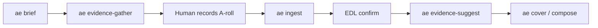

# Evidence production type

Additional style pack for **talking-head + real evidence stills** (channel-breakdown / estimator episodes).

Not the house default — that remains [`styles/tutorial/`](../../styles/tutorial/style.md).

## Full flow (pre-prod → record → edit)



### 1. Episode setup

```yaml
# project.yaml
id: part01-theaigrid
style: evidence
series: ai-youtube-idr
brief:
  channel: TheAIGRID
  # optional overrides:
  # handle: "@theaigrid"
  # youtube_id: UCbY9xX3_jW5c2fjlZVBI4cg
sources:
  cam: raw/cam.mp4
```

### 2. Framework guides you + gathers evidence

```bash
ae brief . --channel TheAIGRID
# → edit/script.md        A-roll teleprompter with [[EVIDENCE:]] cues
# → edit/record.md        human checklist
# → edit/research.json    SocialCounts / vidIQ public numbers
# → edit/evidence.plan.json
# → edit/brief.json

uv sync --extra evidence && uv run playwright install chromium   # once
ae evidence-gather .
# → raw/evidence/*.png    real page screenshots
# → edit/evidence.json    provenance
```

### 3. You record

Read `edit/script.md`. At each `[[EVIDENCE:]]` cue, say the site name + number aloud (so ASR can tie stills later). Save as `raw/cam.mp4`.

### 4. Post-record (existing pipeline)

```bash
ae ingest .
# confirm radio-edit → edl.json
ae cut .
ae evidence-suggest .      # uses plan + ASR deixis
ae evidence-suggest . --apply   # after confirm
# add callout overlays as needed
ae cover .
ae compose . --studio
```

## Why not house-default

Tutorial stays cam+screen Odoo grammar. Evidence adds pre-prod brief/gather + still B-roll without polluting tutorial defaults.

## Cover / overlays

See prior sections: `evidence` / `evidence_with_cam` events; `callout` overlay for Rp honesty beats.
