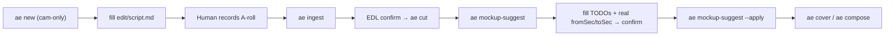

# Mockup production type

Style pack for **talking-head + a Remotion-drawn screen** — no screen
recording at all. Built for the *Claude Skill Lab* series
(`series: claude-skill-lab`).

Not the house default — that remains
[`styles/tutorial/`](../../styles/tutorial/style.md). Full design spec:
[`styles/series/claude-skill-lab/mockup-system.md`](../../styles/series/claude-skill-lab/mockup-system.md).

## Shot grammar

Two states only: **full cam** ⇄ **mockup + cam PIP**. Never full-frame
b-roll — the cam PIP is composited over every drawn scene. Rule 11 in
[`references/rules.md`](../../skills/video-editor/references/rules.md)
waives the "no picture-takeover" rule for this pack only.

## Flow



### 1. Episode setup

```yaml
# project.yaml
id: claude-skill-lab-01-avoid-ai-writing
style: mockup
series: claude-skill-lab
sources:
  cam: raw/cam.mp4          # no raw/screen.mp4
asr:
  language: id
```

### 2. Draft the drawn scenes

```bash
ae mockup-suggest .
# → edit/mockup.suggest.json  one skeleton scene per script beat:
#     heuristic surface (ClaudeChat / DiffPanel / AppWindow / SkillsPanel),
#     a camera skeleton, and <TODO> placeholders.
#   Beat windows come from a fuzzy transcript match; no transcript yet →
#   fromSec/toSec are null and --apply refuses.
```

Fill every `<TODO>`, set real `fromSec`/`toSec` (**cam source seconds**),
adjust `camera[]` / `layers`, propose to the user, **wait for confirm**,
then:

```bash
ae mockup-suggest . --apply       # validates → edit/mockup.json
ae cover . && ae compose .        # remaps scenes + adds a pip_corner cam clip
```

## Components (remotion-kit)

`components/mockup/`: `MockStage` (Mist desktop + window) · `MockCam`
(virtual camera — hold-pose keyframes, caret/cursor follow) · `ClaudeChat`
(types into the input bar, then sends) · `DiffPanel` · `Cursor` ·
`AppWindow` (pptx/xlsx/docx mock or a host still) · `SkillsPanel` ·
`RepoView` (browser frame + real SKILL.md, auto-scroll). Preview them via
the `MockupLab` Remotion composition. Mist tokens + `mock_cam` config
live in [`styles/mockup/style.md`](../../styles/mockup/style.md);
`load_mockup()` merges them over `DEFAULT_MOCK`.

## Skill → GitHub source

[`styles/series/claude-skill-lab/skills.yaml`](../../styles/series/claude-skill-lab/skills.yaml)
maps a skill slug → `{source, repo, branch, path}`. `ae mockup-suggest`
derives the repo URL + raw `SKILL.md` URL (unknown slug →
`anthropics/skills` + `skills/<slug>`), fetches the markdown, and caches
it under `edit/.mockup-cache/`. Offline → RepoView gets a `<TODO>`
placeholder.

## Budget

Keep drawn scenes to **≲ 40 % of runtime** — full-frame React Remotion is
render-heavy. Not enforced; a convention.

## Keywords

mockup, drawn screen, skill lab, claude-skill-lab, MockStage, MockCam,
ClaudeChat, mockup-suggest, mockup.json, no screen recording, pip over
mockup
